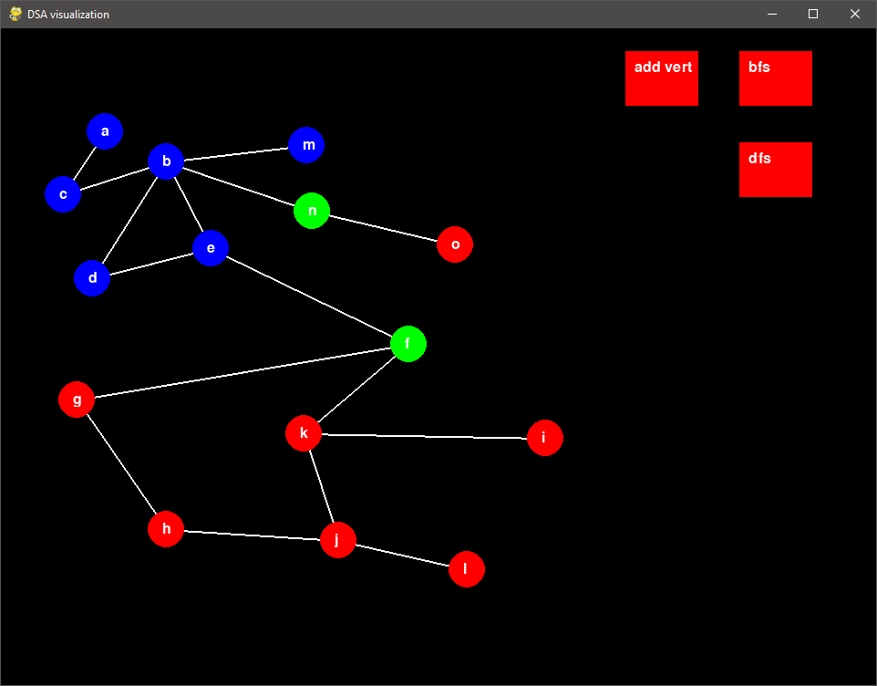

# dsa-visualization
Uses pygame library to create an interactive dsa sandbox. Right now shows graph BFS and DFS. Create, delete, move, and link vertices then see a real time run through of graph search algorithms. 

## Screenshots

